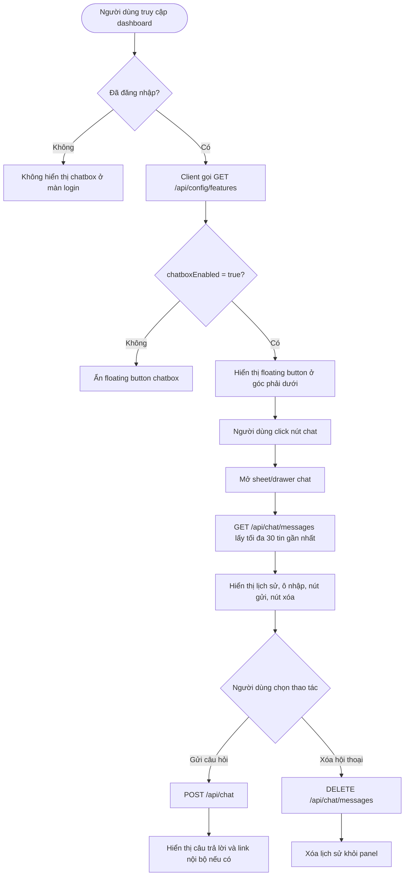
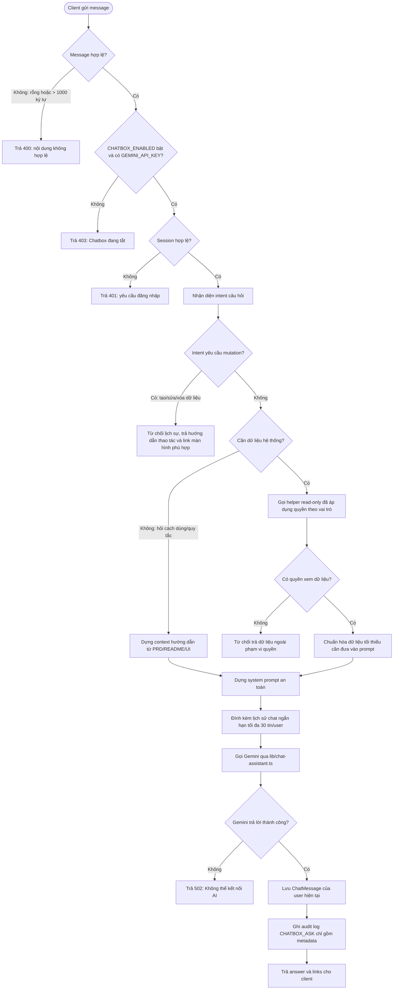
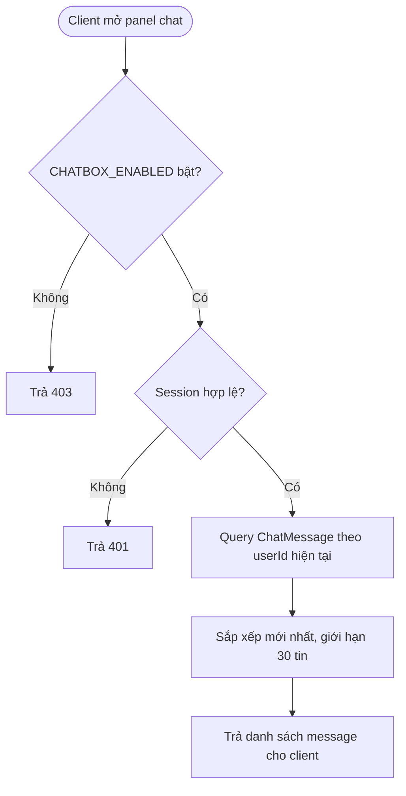
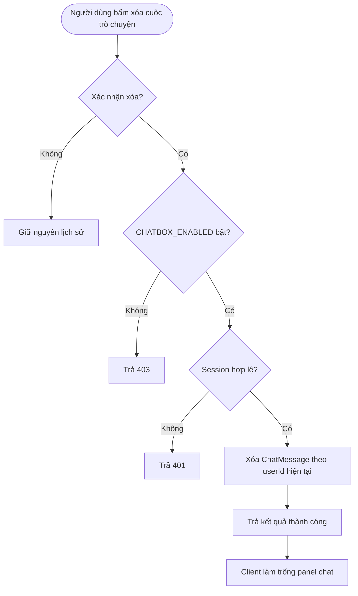
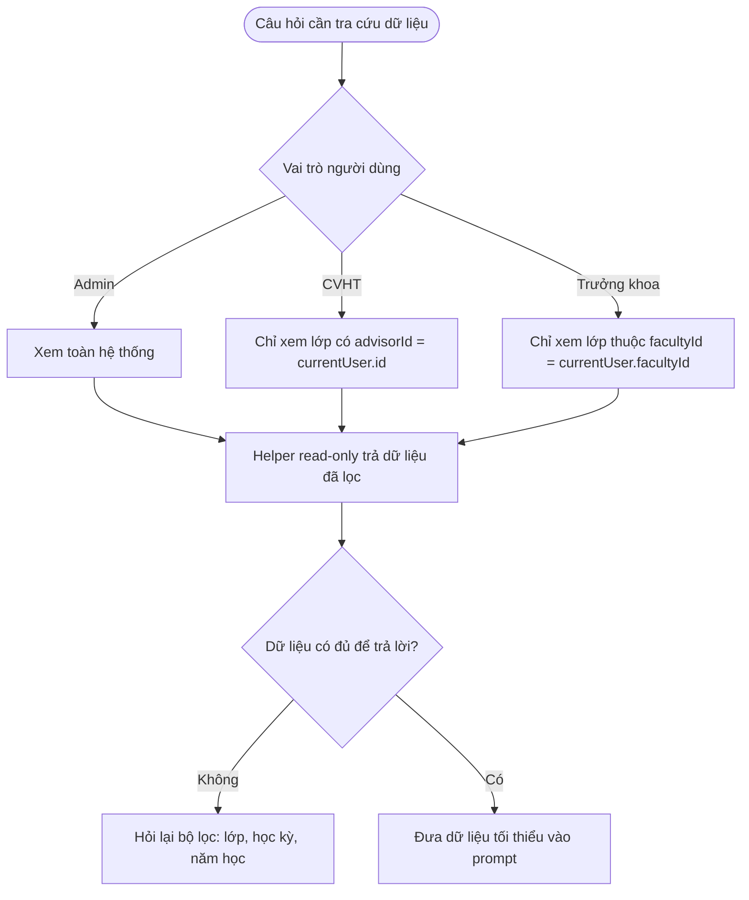

# Flowchart chức năng Chatbox

Tài liệu này mô tả luồng chức năng Chatbox trợ lý trong hệ thống Điểm rèn luyện, dựa trên đặc tả PRD mục 5.11 và 6.6. Chatbox chỉ hỗ trợ hỏi đáp, tra cứu dữ liệu read-only trong phạm vi quyền, và không thực hiện thao tác tạo/sửa/xóa dữ liệu.

## 1. Luồng tổng quan trên giao diện

## 2. Luồng gửi câu hỏi `POST /api/chat`

## 3. Luồng lấy lịch sử `GET /api/chat/messages`

## 4. Luồng xóa lịch sử `DELETE /api/chat/messages`

## 5. Quy tắc phân quyền dữ liệu

## 6. Các nhánh lỗi chính

| Tình huống | Kết quả mong muốn |
| --- | --- |
| `CHATBOX_ENABLED=false` hoặc thiếu `GEMINI_API_KEY` | Ẩn UI, API trả 403 với thông báo "Chatbox đang tắt" |
| Chưa đăng nhập | Không hiển thị ở login, API trả 401 |
| Tin nhắn rỗng hoặc vượt 1.000 ký tự | API trả 400 |
| Hỏi dữ liệu ngoài quyền | Từ chối lịch sự, không đưa dữ liệu ngoài quyền vào prompt |
| Yêu cầu tạo/sửa/xóa dữ liệu | Không thực hiện mutation, chỉ hướng dẫn thao tác thủ công |
| Gemini lỗi quota/timeout/key sai | API trả 502 và thông báo tiếng Việt |
| Câu hỏi mơ hồ về lớp/học kỳ/năm học | Chatbox hỏi lại ngắn gọn hoặc gợi ý chọn bộ lọc |

## 7. Ghi chú triển khai

- `GET /api/config/features` cần bổ sung trường `chatboxEnabled`.
- `lib/features.ts` cần thêm flag `chatbox`.
- `prisma/schema.prisma` cần có model `ChatMessage` nếu triển khai lưu lịch sử.
- `lib/chat-assistant.ts` là nơi dựng system prompt, phân loại intent, gọi helper dữ liệu và gọi Gemini.
- Không log nguyên văn câu hỏi/câu trả lời vào `AuditLog`; chỉ log metadata như `messageLength`, `usedDataScope`, `model`.
